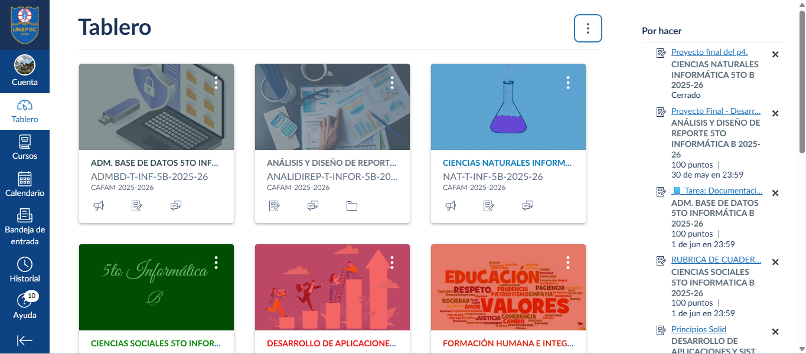
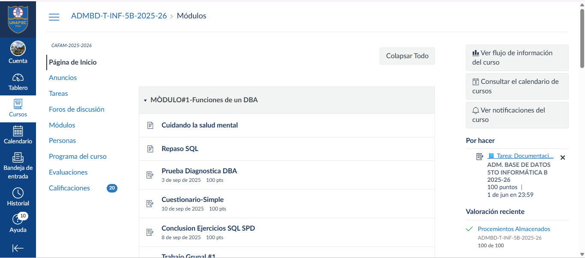
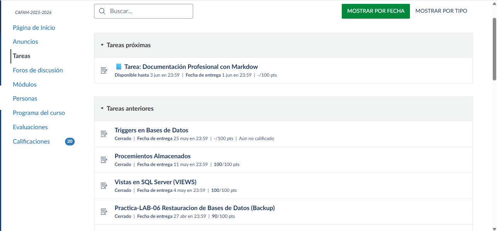
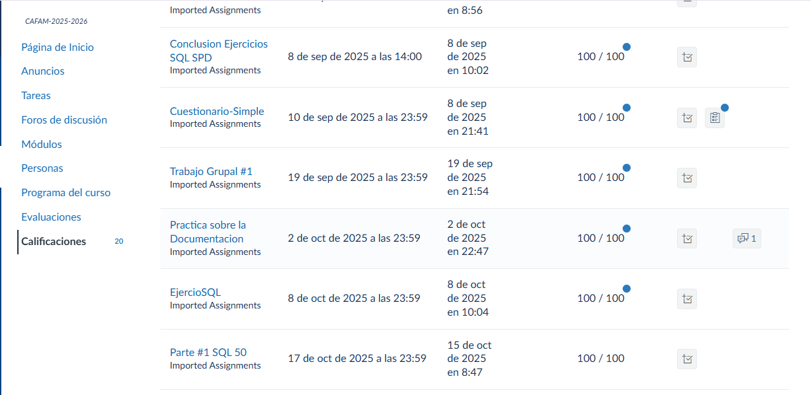
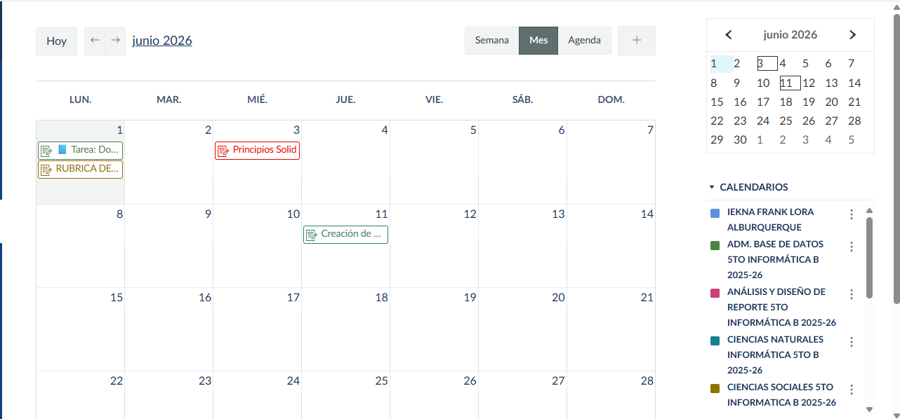
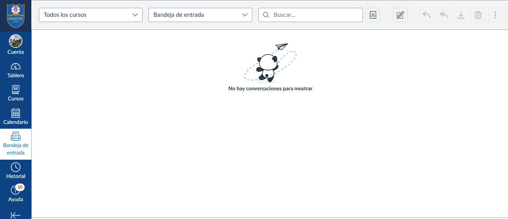
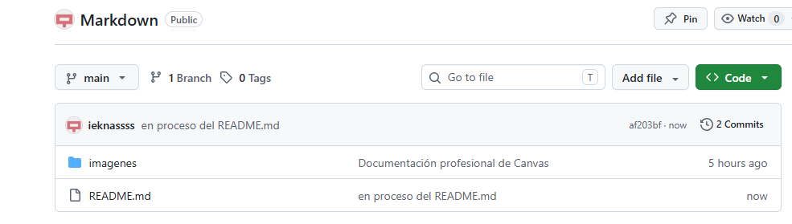

# Investigación y Aplicación de Markdown

## Información General

**Nombre:** Iekna Lora

**Asignatura:** Informática

**Tema:** Investigación, comparación y aplicación de Markdown

**Fecha:** Junio 2026

---

# Índice General

- Parte 1 - Investigación y Análisis
- Parte 2 - Comparación de Herramientas
- Parte 3 - Documentación Profesional de Canvas
- Parte 4 - Reflexión
- Reto
- Conclusión General

# Parte 1 - Investigación y Análisis

## Conceptos Básicos

### ¿Qué es Markdown?

Markdown es un lenguaje de marcado ligero que permite dar formato a documentos utilizando una sintaxis sencilla basada en texto plano. Fue creado con el objetivo de facilitar la escritura y lectura de documentos sin necesidad de utilizar herramientas complejas.

---

### ¿Para qué se utiliza actualmente?

Actualmente Markdown se utiliza para crear documentación técnica, archivos README en GitHub, blogs, manuales de usuario, documentación de software, apuntes académicos y contenido web. Su simplicidad y compatibilidad lo han convertido en una herramienta ampliamente utilizada en el ámbito tecnológico.

---

### ¿Cuáles son las ventajas de usar Markdown?

Markdown posee numerosas ventajas debido a su simplicidad, rapidez y facilidad de uso. Permite crear documentos organizados utilizando una sintaxis mínima, es compatible con múltiples plataformas, ocupa poco espacio de almacenamiento y puede convertirse fácilmente a formatos como HTML y PDF.

---

### ¿Qué limitaciones tiene Markdown?

Aunque Markdown es muy práctico, presenta algunas limitaciones. Ofrece menos opciones de diseño y personalización que HTML, algunas funciones avanzadas requieren extensiones adicionales y no está diseñado para crear interfaces complejas o altamente visuales.

---

### ¿Qué significa que Markdown sea un lenguaje ligero?

Significa que utiliza una sintaxis simple y mínima para aplicar formato al texto sin requerir herramientas complejas. Esto facilita tanto la escritura como la lectura de los documentos y permite que sean compatibles con una gran variedad de plataformas.

---

## Sintaxis Básica de Markdown

### Títulos y Subtítulos

Los títulos se crean utilizando el símbolo #

#### Ejemplo

```text
# Título Principal
## Subtítulo
### Subtítulo Menor
```

#### Resultado

# Título Principal

## Subtítulo

### Subtítulo Menor

---

### Texto en Negrita y Cursiva

La negrita se realiza utilizando dos asteriscos (**), mientras que la cursiva utiliza un solo asterisco (*).

#### Ejemplo

```text
**Texto en negrita**

*Texto en cursiva*
```

#### Resultado

**Texto en negrita**

*Texto en cursiva*

---

### Listas Ordenadas y Desordenadas

Las listas ordenadas utilizan números y las desordenadas utilizan guiones.

#### Ejemplo

```text
1. Primer elemento
2. Segundo elemento
3. Tercer elemento

- Elemento A
- Elemento B
- Elemento C
```

#### Resultado

1. Primer elemento
2. Segundo elemento
3. Tercer elemento

- Elemento A
- Elemento B
- Elemento C

---

### Enlaces

Los enlaces permiten dirigir al usuario a páginas web.

#### Ejemplo

```text
[Google](https://www.google.com)
```

#### Resultado

[Google](https://www.google.com)

---

### Imágenes

Las imágenes se insertan mediante una ruta o URL.

#### Ejemplo

```text

```

#### Resultado


---

### Bloques de Código

Sirven para mostrar código de programación.

#### Ejemplo

````text
```html
<h1>Hola Mundo</h1>
<p>Primer ejemplo HTML</p>
````

---

### Tablas

Markdown permite organizar información en tablas.

#### Ejemplo

| Nombre | Edad |
|---------|------|
| Genesis | 17 |
| Alissa | 18 |

---

### Citas

Se utilizan para resaltar frases o comentarios.

#### Ejemplo

> Markdown es sencillo y eficiente.

---
### Checklists

Permiten crear listas de tareas.

#### Ejemplo

- [x] Estoy cansada
- [x] Tengo sueño
- [ ] Llegada de Vacaciones

---


# Parte 2 - Comparación de Herramientas


---

## Markdown

Markdown es un lenguaje de marcado ligero diseñado para facilitar la creación de documentos con formato utilizando una sintaxis simple y fácil de leer. Actualmente es una de las herramientas más utilizadas en el ámbito de la programación y la documentación técnica, especialmente en plataformas como GitHub. Su principal ventaja es que permite escribir contenido estructurado de forma rápida sin depender de editores visuales complejos.

---

## Notion

Notion es una plataforma moderna de productividad que combina documentos, bases de datos, listas de tareas, calendarios y colaboración en línea dentro de un mismo espacio de trabajo. Gracias a su interfaz visual e intuitiva, permite organizar información de manera flexible y atractiva.

---

## Obsidian

Obsidian es una aplicación enfocada en la gestión del conocimiento personal mediante la creación y conexión de notas. Utiliza archivos Markdown como base, permitiendo que los usuarios mantengan el control de su información de forma local en sus dispositivos.


---

## Google Docs

Google Docs es un procesador de texto basado en la nube que permite crear, editar y compartir documentos de manera colaborativa. Su principal ventaja es que varias personas pueden trabajar simultáneamente en un mismo archivo y ver los cambios en tiempo real.


---

## Tabla Comparativa General

| Característica | Markdown | Notion | Obsidian | Google Docs |
|---------------|-----------|---------|----------|-------------|
| Facilidad de uso | Media | Alta | Media | Muy alta |
| Trabajo colaborativo | Bajo | Excelente | Bajo | Excelente |
| Organización de información | Buena | Excelente | Excelente | Buena |
| Compatibilidad | Muy alta | Alta | Alta | Muy alta |
| Exportación de documentos | Buena | Buena | Buena | Excelente |
| Uso profesional | Muy alto | Muy alto | Alto | Alto |
| Curva de aprendizaje | Baja | Baja | Media | Muy baja |
| Dependencia de internet | No | Sí | No | Parcial |
| Uso en programación | Excelente | Bueno | Muy bueno | Limitado |
| Personalización | Media | Alta | Muy alta | Media |
| Almacenamiento local | Sí | No | Sí | No |
| Integración con GitHub | Excelente | Limitada | Buena | Limitada |
| Velocidad de trabajo | Muy alta | Alta | Alta | Media |
| Formato visual | Básico | Muy atractivo | Medio | Avanzado |
| Costo | Gratuito | Freemium | Freemium | Gratuito |

---

## Conclusión

Cada herramienta tiene objetivos diferentes. Markdown es la mejor alternativa para documentación técnica y proyectos de programación debido a su ligereza, compatibilidad y facilidad de mantenimiento. Sin embargo, cuando se requiere colaboración en tiempo real o una interfaz más visual, herramientas como Notion y Google Docs pueden resultar más convenientes. Obsidian, por su parte, representa una excelente opción para la organización personal y la gestión avanzada del conocimiento.

---
---

# Parte 3 - Documentación Profesional de Canvas

---
---

# Manual Completo de Canvas para Estudiantes

---

## Información General

**Estudiante:** Iekna F. Lora Alburquerque

**Asignatura:** 5to B. Informática

**Tema:** Manual de Uso de Canvas

**Institución:** Colegio CAFAM

**Fecha:** 1 de Junio del 2026

---

### Descripción

Este documento presenta una guía completa sobre el uso de la plataforma Canvas, explicando sus principales funciones, herramientas y beneficios para los estudiantes. Además, se incluyen capturas reales de la plataforma para facilitar la comprensión de cada proceso.

---

## Índice

1. Introducción
2. ¿Qué es Canvas?
3. Acceso a la plataforma
4. Página principal
5. Acceso a los cursos
6. Entrega de tareas
7. Consulta de calificaciones
8. Calendario académico
9. Comunicación con los profesores
10. Tabla de funciones y beneficios
11. Ejemplo de código
12. Recursos externos
13. Conclusiones

---

#  Introducción

Canvas es una plataforma educativa utilizada por instituciones académicas para gestionar clases virtuales, asignaciones, evaluaciones y comunicación entre estudiantes y profesores.

Su objetivo es facilitar el aprendizaje digital permitiendo acceder a materiales, tareas y calificaciones desde cualquier lugar.

---

#  ¿Qué es Canvas?

Canvas es un Learning Management System (LMS), o Sistema de Gestión del Aprendizaje, diseñado para facilitar la enseñanza y el aprendizaje en entornos virtuales. Esta plataforma permite centralizar toda la información académica de una asignatura en un solo lugar.

Los docentes pueden publicar contenidos, asignar tareas, realizar evaluaciones y compartir recursos educativos, mientras que los estudiantes pueden acceder a estos materiales, completar actividades y realizar seguimiento de su progreso académico.

Actualmente, Canvas es una de las plataformas educativas más utilizadas debido a su facilidad de uso, diseño intuitivo y gran variedad de herramientas para el aprendizaje digital.

---

#  Características principales de Canvas

Canvas ofrece múltiples herramientas diseñadas para mejorar la experiencia educativa tanto de estudiantes como de docentes. Gracias a su interfaz intuitiva, permite acceder a todos los recursos académicos desde una sola plataforma, facilitando la organización y el seguimiento de las actividades escolares.

### Funciones destacadas

- [x] Gestión de tareas y actividades.
- [x] Consulta de calificaciones en tiempo real.
- [x] Comunicación entre estudiantes y profesores.
- [x] Acceso a materiales y recursos digitales.
- [x] Calendario académico integrado.
- [x] Evaluaciones y cuestionarios en línea.
- [x] Organización de contenidos por módulos.
- [x] Notificaciones y recordatorios automáticos.

---

#  Acceso a la plataforma

Para ingresar a Canvas:

1. Abrir el navegador web.
2. Acceder al portal institucional.
3. Introducir usuario y contraseña.
4. Seleccionar el curso correspondiente.

---

#  Página Principal


La página principal es el primer espacio que visualiza el estudiante al ingresar a Canvas. Desde aquí es posible acceder rápidamente a los cursos matriculados, eventos importantes y actividades pendientes.

Esta sección funciona como un panel de control que permite visualizar información relevante de manera organizada y facilita la navegación por toda la plataforma.

---

#  Acceso a los Cursos



Los cursos representan los espacios virtuales donde se desarrolla cada asignatura. Dentro de ellos se encuentran los materiales de estudio, anuncios, tareas, evaluaciones y recursos compartidos por los profesores.

La organización por módulos permite que los estudiantes accedan fácilmente a los contenidos necesarios para cada tema.

---

#  Entrega de Tareas



Canvas permite entregar asignaciones de manera rápida y segura. Para realizar una entrega correctamente se recomienda seguir los siguientes pasos:

1. Ingresar a la actividad asignada.
2. Leer cuidadosamente las instrucciones.
3. Adjuntar el archivo solicitado.
4. Verificar que el documento cargó correctamente.
5. Presionar el botón de envío.
6. Confirmar que la entrega fue registrada por la plataforma.

Este proceso garantiza que el profesor pueda recibir y evaluar el trabajo enviado por el estudiante.

---

#  Consulta de Calificaciones



La sección de calificaciones permite consultar el rendimiento académico dentro de cada asignatura. Los estudiantes pueden visualizar sus notas, comentarios del profesor y el estado de las actividades evaluadas.

Gracias a esta herramienta es posible identificar fortalezas, áreas de mejora y mantener un seguimiento constante del progreso académico.

---

#  Calendario Académico



El calendario ayuda a organizar las actividades académicas mostrando fechas importantes, entregas de tareas, exámenes y eventos relacionados con los cursos.

Utilizar esta función permite planificar mejor el tiempo y evitar retrasos en las responsabilidades escolares.

---

#  Comunicación con los Profesores



Canvas incluye herramientas de comunicación que permiten el intercambio de mensajes entre estudiantes y docentes. Esto facilita la resolución de dudas, el envío de información y la coordinación de actividades académicas.

Una comunicación efectiva contribuye al éxito del proceso de aprendizaje y fortalece la relación entre profesores y estudiantes.


---


# Funciones principales

- Consultar tareas.
- Ver anuncios.
- Descargar materiales.
- Participar en foros.
- Realizar exámenes.
- Revisar calificaciones.

---


# Tabla de ventajas

| Herramienta | Función Principal | Beneficio |
|------------|------------------|------------|
| Cursos | Organización académica | Acceso rápido a contenidos |
| Tareas | Entrega de actividades | Seguimiento del progreso |
| Calificaciones | Evaluación académica | Monitoreo del rendimiento |
| Calendario | Gestión del tiempo | Mejor planificación |
| Mensajes | Comunicación | Resolución de dudas |
| Recursos | Material de estudio | Aprendizaje continuo |
---

# Ejemplo de código

```html
<h1>Mi primera página web</h1>
<p>Hola Mundo</p>
```

---

# Recursos externos

Sitio oficial de Canvas:

https://servicios.unapec.edu.do/canvasunapec/

Documentación oficial:

https://community.instructure.com/en/categories/canvas

---

# Conclusiones

Canvas es una plataforma educativa moderna que facilita la organización académica y la comunicación entre estudiantes y docentes.

Su interfaz sencilla y sus múltiples herramientas permiten mejorar la experiencia de aprendizaje y el acceso a los recursos educativos.

---
---
---

# Parte 4 - Reflexión
---
---

## ¿Por qué Markdown es tan utilizado en programación y tecnología?

Porque permite crear documentación clara, organizada y fácil de mantener utilizando una sintaxis sencilla. Además, es compatible con plataformas como GitHub, GitLab y otras herramientas de desarrollo, lo que facilita compartir información técnica de manera eficiente. Su simplicidad permite que los desarrolladores se concentren en el contenido sin preocuparse demasiado por el formato.

---

## ¿En qué situaciones preferirías Markdown sobre herramientas visuales como Notion?

Preferiría Markdown cuando necesite crear documentación técnica, manuales de usuario, archivos README o proyectos relacionados con programación. También lo utilizaría cuando sea importante la compatibilidad entre plataformas, la rapidez de edición y la posibilidad de trabajar sin conexión a internet. Para proyectos donde el contenido sea más importante que el diseño visual, Markdown resulta una excelente opción.

---

## ¿Qué ventajas ofrecen las plataformas colaborativas frente a Markdown tradicional?

Las plataformas colaborativas ofrecen la posibilidad de que varias personas trabajen simultáneamente en un mismo documento, realicen comentarios en tiempo real y compartan información de manera más dinámica. Además, suelen incluir herramientas adicionales como bases de datos, calendarios, recordatorios y sistemas de organización visual que facilitan el trabajo en equipo y la gestión de proyectos.

---

## ¿Crees que Markdown seguirá siendo relevante en el futuro? ¿Por qué?

Sí, porque se ha convertido en un estándar dentro de la industria tecnológica. Su simplicidad, compatibilidad y facilidad de integración con nuevas herramientas hacen que continúe siendo una opción eficiente para la creación de documentación digital. 
---
---

# Reto
---

## Publicación en GitHub

La documentación fue publicada en GitHub utilizando un repositorio público. Esto permitió visualizar correctamente la estructura Markdown, las imágenes, tablas y demás elementos incluidos en el proyecto.




### Organización del Proyecto

El proyecto fue organizado mediante un archivo README.md principal y una carpeta llamada imagenes, donde se almacenaron todas las capturas de pantalla utilizadas en la documentación de Canvas.

### Enlace del Proyecto

https://github.com/ieknassss/Markdown.git

---

